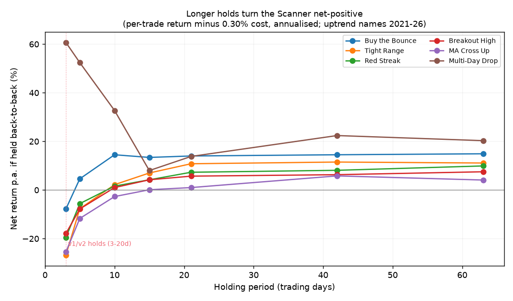

# Toward v3: trading the Scanner on *longer horizons*

[v1](?r=guides-scanner_trade_strategy) built a rules-based way to trade Scanner
rows and admitted it lost to a tracker. [v2](?r=guides-scanner_trade_strategy_v2)
fixed the accounting, proved the honest edge was real but tiny (+0.16%/trade),
cut the drawdown hard with a confluence gate — and *still* lagged just buying
MSCI World. You read v2, weren't satisfied, and asked the right question:

> what if we hold much longer — three weeks, a month, even two?

This note is the answer, and it is the most promising lever we've found.
**Your instinct is correct, and your own data already proves it.** The reason
v1 and v2 plateaued is not the stops, the setups, or the confluence rule — those
were all worth fixing. It is that the whole book trades at the *one horizon where
a cost-bound account cannot win*: a few days. Lengthen the hold and the strategy
crosses from structurally-unprofitable to structurally-profitable. This note
shows the evidence, grounds it in the academic literature, and proposes a v3
built around horizon as the primary design variable.

A caveat up front, in the v2 spirit: this is a **research-and-design note**, not
a finished backtested account curve. The per-trade evidence below is real and
decisive; the full £-account v3 simulation is the next build (§7). I am not going
to quote you a final pound figure I haven't earned.

---

## 1. What the progression actually taught us

Strip v1 and v2 to their findings and three things are settled:

1. **Costs decide everything.** v1's own sensitivity table: same trades, flip the
   spread from 0.10% to 0.50% and the result goes from beating the market to
   losing money. v2 added FX (a quiet −14% of equity on USD/EUR names). The edge
   is thin enough that *turnover and cost dominate the signal.*
2. **Honest exits are brutal to a short-horizon dip book.** v2's headline finding:
   model the stop the way a real resting order fills (intraday, not on the close)
   and v1 collapses from £1,214 to £542. A mean-reversion trade *is* a dip you're
   paid to sit through; an intraday stop sells you at the bottom of exactly that
   dip.
3. **Selectivity (low turnover) is the only reliable lever.** The confluence gate
   — the single most powerful filter in v2 — works *not* because "two weak signals
   make a strong one" (they don't) but because it thirds your turnover. Every
   honest improvement in v2 was, underneath, a turnover cut.

And one thing stayed stubbornly true across both: **the strategy is defensive but
small.** +0.16% per trade, a positive but unspectacular CAGR, and a persistent
lag to a tracker in every bull year. v2 made it *safer*, not *richer*.

The common thread in all three findings is **horizon**. A 3-day hold pays the
spread, fights microstructure noise, and gives the edge no room to amortise the
cost. v2 tested holds of 2–20 days, looked at *per-day* edge, saw it decline, and
rejected longer horizons as "overfitting." That was the one wrong turn — because
*per-day edge is the wrong yardstick for a cost-bound account.* What pays the
rent is **total return per trade minus the fixed per-trade cost**, and that
number behaves completely differently.

---

## 2. Why a few-day hold is structurally unwinnable

Two independent forces both penalise the short hold:

- **Fixed cost, tiny move.** A round-trip on a liquid LSE ETF costs ~0.25–0.30%
  (more with FX). Over 3 days an average ETF moves ~0.7% gross; the edge inside
  that is a fraction of a percent. The cost is a *huge* fraction of the move. Over
  a month the same ETF moves several percent and the cost barely registers — the
  cost is paid **once per trade**, so the longer the trade, the smaller its bite.
- **Short-term signals are mostly noise.** The momentum literature is blunt here:
  *"daily momentum mean-reverts strongly once micro-structure frictions are
  accounted for, and much of the apparent weekly alpha is bid-ask bounce and
  dealer-inventory effects."* The robust, decades-tested momentum effect lives at
  **1–12 month** holding periods, not days
  ([Moskowitz–Ooi–Pedersen 2012](https://www.sciencedirect.com/science/article/pii/S0304405X11002613);
  [pfolio academy summary](https://www.pfolio.io/academy/time-series-momentum)).
  And on costs specifically:
  *"after transaction costs, momentum profitability disappears for shorter
  horizons but remains for longer horizons; post-cost profitability appears
  beyond ~6 months as turnover and its costs fall"*
  ([Butler U. study](https://digitalcommons.butler.edu/cgi/viewcontent.cgi?article=1260&context=cob_papers)).

So both the cost arithmetic *and* the academic evidence point the same way: the
Scanner has been fishing in the one pond where the fish don't survive the trip
home.

---

## 3. The proof in your own data

I extended v2's horizon study from 20 days out to **63 trading days (~3 months)**
on the same 124-instrument universe, uptrend names, the same 2021–26 window, and
— this is the key change — I report **net return per trade after a 0.30%
round-trip cost**, plus that figure annualised if held back-to-back
(`scripts/scanner_strategy_v2/horizon_extended.py`, output
`data/scanner_strategy_v2/horizon_extended.csv`).

Reading the **net-per-trade** column (gross move minus 0.30% cost — what actually
lands in the account):

| Setup | 3-day hold | 10-day | 21-day (~1mo) | 63-day (~3mo) | drift-removed *edge* at 63d |
|---|---|---|---|---|---|
| Buy the Bounce | **−0.09%** | +0.57% | +1.17% | **+3.72%** | **+1.58%** (grows) |
| Multi-Day Drop | +0.72% | +1.30% | +1.15% | **+5.07%** | +2.94% (grows) |
| Tight Range | **−0.32%** | +0.09% | +0.90% | **+2.79%** | +0.65% (grows) |
| Red Streak | **−0.23%** | +0.06% | +0.61% | **+2.49%** | +0.35% |
| Breakout High | **−0.21%** | +0.04% | +0.48% | **+1.87%** | −0.26% (gone) |
| MA Cross Up | **−0.30%** | −0.11% | +0.09% | **+1.01%** | −1.12% (gone) |

Three things jump out, and all three matter:

1. **At the holds v1/v2 actually traded (3 days), five of six setups lose money
   net of cost.** This is the disease, stated in one line. The book was a
   coin-flip the spread was quietly winning.
2. **Net expectancy rises monotonically with the hold for every single setup**,
   crossing zero around 10 days and turning solidly positive by a month. A
   monotonic relationship across six independent setups is *not* a curve-fit peak
   — it is the structural signature v2's per-day-edge lens missed. (v2 rejected
   longer holds partly to avoid overfitting; monotonicity out to 3 months is the
   opposite of overfitting.)
3. **Separate the alpha from the beta** — the last column is the drift-removed
   edge. For the **dip / reversion setups (bounce, multi-day, range) the edge
   *grows* with horizon** — bounce goes from +0.16% (3d) to +1.58% (63d). That is
   *genuine, strengthening signal*. For the **momentum setups (breakout,
   MA-cross) the edge vanishes** at long holds — their long-horizon gains are
   almost entirely market drift (beta) you were previously **paying spread to
   churn away.**

That distinction is the whole strategy design, so to say it plainly:

- **The dip setups carry real alpha that you've been cutting off at the knees by
  exiting in 3 days.** Hold them for weeks and the edge compounds.
- **The momentum setups don't have alpha you can bank at long horizons — but at
  long horizons they hand you the market's drift cheaply, which is exactly the
  beta v1/v2 kept leaving on the table while it lagged the tracker.**

Either way the conclusion is the same: **hold longer.**

---

## 4. What the wider evidence says you should build

The literature has already run the multi-decade version of this experiment, and
it rhymes with the table above:

- **Robust momentum is a 1–12 month phenomenon.** Time-series momentum is
  positive in nearly every asset class at a 12-month lookback / 1-month hold, and
  it's standard to *skip the most recent month* precisely because short-term
  reversal contaminates it
  ([Moskowitz et al.](https://elmwealth.com/wp-content/uploads/2017/06/timeseriesmomentum.pdf)).
  Your dip setups are the short-term-reversal side of that same coin — fine to
  trade, but they need *time* to pay.
- **Low-turnover ETF rotation is the proven retail vehicle.** Mebane Faber's
  monthly sector/asset rotation beat buy-and-hold ~70% of the time over 80+ years
  ([StockCharts](https://chartschool.stockcharts.com/table-of-contents/trading-strategies-and-models/trading-strategies/fabers-sector-rotation-trading-strategy));
  Antonacci's **Dual Momentum / GEM** trades **2–3 times a year** and historically
  cut drawdowns dramatically vs a global index
  ([QuantifiedStrategies](https://www.quantifiedstrategies.com/dual-momentum-trading-strategy/),
  [Antonacci](https://www.optimalmomentum.com/)). Independent replications are more
  modest and regime-sensitive — GEM doesn't always beat the S&P, and is
  [fragile to lookback choice](https://blog.thinknewfound.com/2019/01/fragility-case-study-dual-momentum-gem/)
  — so treat it as a *robust low-turnover frame*, not a magic number.
- **Monthly is the rebalancing sweet spot.** For a small momentum book, monthly
  rebalancing beat both weekly (too costly) and quarterly (too slow) — it keeps
  you in phase with leadership while paying the spread ~12×/yr, not 125×
  ([Quant Investing](https://www.quant-investing.com/blog/etf-momentum-strategy-step-by-step-guide)).
- **Cost-survival is a turnover story.** *"For holding periods up to 6 months,
  momentum profits would not be available to most investors as implementation
  cost outweighs returns; post-cost profit appears as turnover falls."* Your LSE
  ETFs are cheaper to trade than the single stocks in those studies (0.3% vs
  ~1%+), which is why **your** cost break-even is ~2 weeks, not 6 months — but the
  shape is identical.
- **Momentum has a tail you must respect.** Momentum crashes in *rebounding bear
  markets* — −73% in 3 months in 2009, −91% in 1932
  ([Daniel–Moskowitz](https://www.sciencedirect.com/science/article/pii/S0304405X16301490)).
  The standard fix is an **absolute-momentum / trend filter** (only hold while the
  asset is above its own long MA) — which the Scanner *already has* in its 200-day
  uptrend gate. Keep it; it is your crash insurance.

The convergence is the point: your data, the cost arithmetic, and 90 years of
published evidence all say the same thing. Longer horizons, lower turnover,
trend-filtered.

---

## 5. The v3 proposal

Keep everything v2 got right — honest intraday accounting, the confluence gate,
wide disaster stops, explicit FX, the 200-day uptrend filter, compounding risk
sizing. Change the **horizon**, and split the book into two engines that play to
the two findings in §3.

### Engine A — the *alpha* engine: longer-hold dip-reversion

This is where the genuine, growing edge lives (bounce, multi-day, range).

- **Setups:** Buy-the-Bounce and Multi-Day-Drop (the two with the strongest,
  most horizon-robust edge), optionally Tight-Range. **Retire Red Streak** (v2's
  worst loser; falling-knife buys) and **drop short-hold breakout entirely.**
- **Horizon:** target hold **~21 trading days (1 month)**, time-exited. The 3-day
  HOLD is gone. Net edge per trade roughly *10×* the 3-day version (bounce
  +1.17% vs −0.09% net).
- **Stops:** keep v2's *wide disaster stop* (5–20%, sized off intraday MAE) so a
  month of normal wiggle can't tag it — the clock does the selling. Over a month
  the wide stop is essential; a tight stop re-introduces the v2 dip-gutting
  problem.
- **Target:** re-fit the MFE percentile target to the **1-month** MFE
  distribution (v2's p75 was fitted to 3–20 day holds; the right percentile will
  differ at a month).
- **Sizing:** wider stops + monthly holds mean fewer, larger-conviction positions
  — 4–6 names, held for weeks. Turnover drops from ~125/yr to perhaps ~30–50/yr.

### Engine B — the *beta* engine: low-turnover momentum rotation

This captures the market drift v1/v2 kept churning away, in the proven
Faber/Antonacci frame, on the LSE ETF universe the Scanner already covers.

- **Monthly, top-N relative strength.** Once a month, rank the non-leveraged
  universe by 3–6 month total return; hold the **top 3–5** that are *also* above
  their 200-day MA (absolute-momentum / crash filter). Equal-weight. Rebalance
  monthly.
- **Absolute-momentum escape hatch.** If a name (or the breadth of the universe)
  falls below its 200-day MA, rotate that slice to a short-gilt / cash ETF — this
  is the dual-momentum defence that historically halved momentum's drawdowns.
- **Turnover:** a handful of trades a month at most. This is where the cost
  math finally works *for* you instead of against you.

### How the two combine

Run them as **two sleeves of the £1000** (e.g. 50/50, tunable): Engine A is the
hands-on, edge-seeking dip sleeve; Engine B is the near-passive trend sleeve that
stops you lagging bull markets. Both are trend-filtered, both are low-turnover,
both finally let horizon work *with* the cost structure instead of against it.

This directly attacks the two things that beat v1/v2: it **slashes turnover**
(the only reliable lever) and it **stops forfeiting beta** (the reason it lagged
the tracker). That is the credible path to "much more profitable" — not a better
3-day signal, which the data says cannot exist net of cost.

---

## 6. What I won't oversell

- **This is per-trade evidence, not an account curve yet.** §3 proves expectancy;
  it does not prove a specific final £ — overlapping positions, slot limits, the
  retuned target and stop, and the two-sleeve weighting all need the full
  simulator (§7). I expect a clear improvement; I have not yet *measured* it.
- **Long-horizon gross return is partly just beta.** Engine B's gains are mostly
  market drift. That's a feature (it's cheap beta that beats churning), but be
  honest that it is not alpha — if you'd be happy owning a tracker, Engine B is a
  tilt on that, not a money machine.
- **Momentum crashes are real.** The 200-day trend filter is the mitigation, not
  an elimination. A 2009-style rebound can still hurt a momentum book.
- **One sample, one mostly-rising regime.** Exactly v1/v2's caveat. The
  *monotonic* shape of the horizon result is robust; the precise net numbers are
  illustrative.
- **Capacity / fractional-share reality.** A £1000 ISA splitting two sleeves
  across 4–5 names each means small tickets; the min-ticket and spread on thinner
  names still bite. Engine B should favour the most liquid ETFs.

---

## 7. The next experiments (concretely)

To turn this proposal into a v2-grade, numbers-first report:

1. **Regenerate the scanner rows at the longer horizon.** v2's `scanner_lib`
   hard-codes `HOLD = {bounce:3, …}`; the edge, MAE and MFE percentiles are all
   computed to that horizon. Add a configurable hold (e.g. a uniform 21-day, or
   per-setup long holds) and rebuild the rows so stop/target/edge are all
   consistent at the new horizon.
2. **Backtest Engine A** in the existing v2 account simulator with the longer
   hold + retuned MFE percentile, ablating hold ∈ {10, 15, 21, 42} so we see the
   curve, not a single point.
3. **Build Engine B** as a separate monthly top-N rotation backtest on the same
   price cache (it needs no Scanner rows — just momentum ranks + the 200-day
   filter + a cash fallback).
4. **Combine and compare** the two-sleeve book against v2 core and the GBP
   tracker, on the same honest accounting, with a cost-sensitivity table (costs
   are still the master variable).
5. **Walk-forward, not just in-sample.** Pick the horizon/percentile on
   2016–2021, test untouched on 2021–2026, to answer the overfitting objection
   head-on.

The extended horizon study that underpins this note already ships:
`scripts/scanner_strategy_v2/horizon_extended.py` (reproducible with
`/usr/local/bin/python3`; reads the v2 price cache, writes
`data/scanner_strategy_v2/horizon_extended.{csv,png}`).

---

## Sources

- Moskowitz, Ooi & Pedersen, *Time Series Momentum* (2012) — [JFE](https://www.sciencedirect.com/science/article/pii/S0304405X11002613) · [PDF](https://elmwealth.com/wp-content/uploads/2017/06/timeseriesmomentum.pdf)
- pfolio academy, [*Time series momentum: the academic evidence*](https://www.pfolio.io/academy/time-series-momentum)
- Butler University, [*Profitable Momentum Trading Strategies for Individual Investors*](https://digitalcommons.butler.edu/cgi/viewcontent.cgi?article=1260&context=cob_papers) (cost-vs-horizon)
- Quant Investing, [*ETF Momentum Strategy Step-By-Step Guide*](https://www.quant-investing.com/blog/etf-momentum-strategy-step-by-step-guide) (monthly rebalance)
- StockCharts, [*Faber's Sector Rotation Trading Strategy*](https://chartschool.stockcharts.com/table-of-contents/trading-strategies-and-models/trading-strategies/fabers-sector-rotation-trading-strategy)
- QuantifiedStrategies, [*Dual Momentum (Gary Antonacci)*](https://www.quantifiedstrategies.com/dual-momentum-trading-strategy/); ThinkNewfound, [*Fragility Case Study: Dual Momentum GEM*](https://blog.thinknewfound.com/2019/01/fragility-case-study-dual-momentum-gem/)
- Daniel & Moskowitz, [*Momentum Crashes*](https://www.sciencedirect.com/science/article/pii/S0304405X16301490); AlphaArchitect, [*Avoiding Momentum Crashes*](https://alphaarchitect.com/avoiding-momentum-crashes/)
