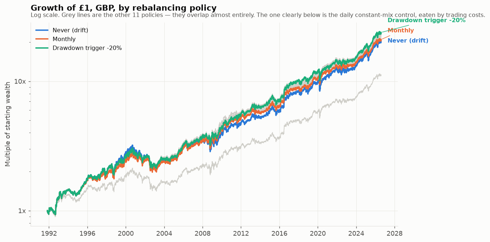
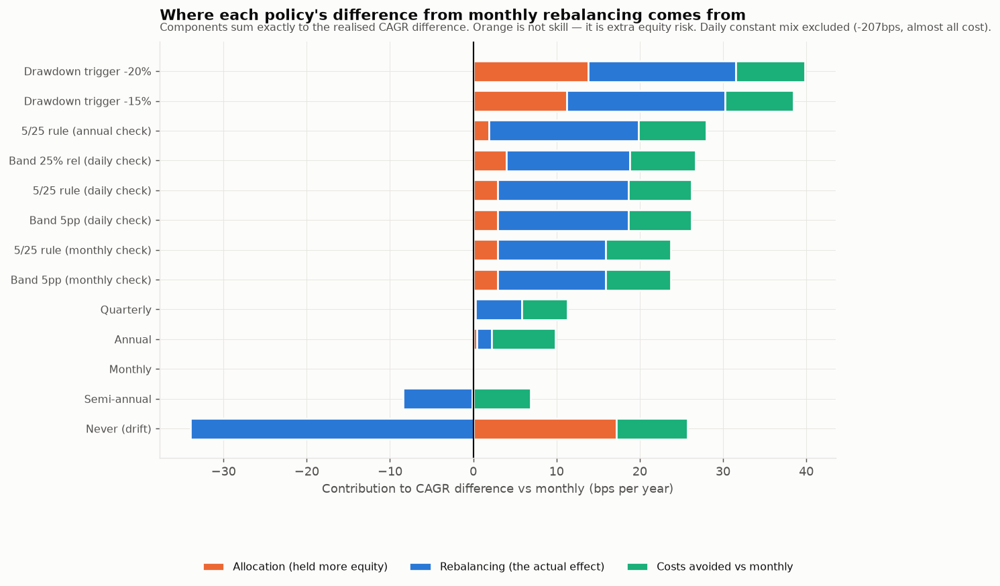
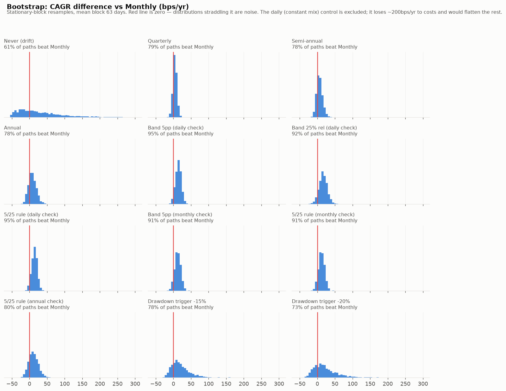
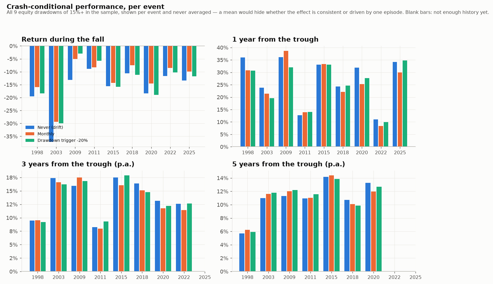
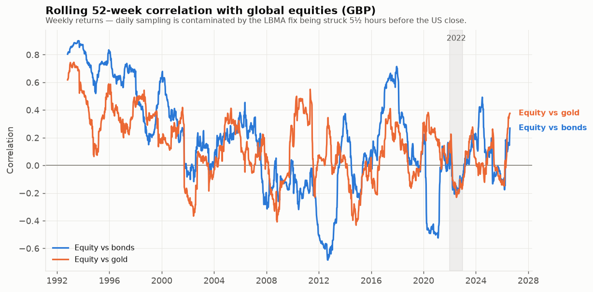
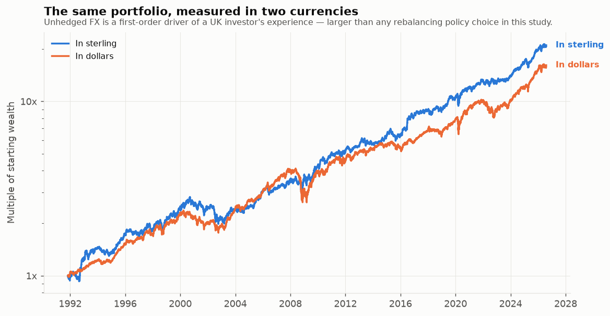
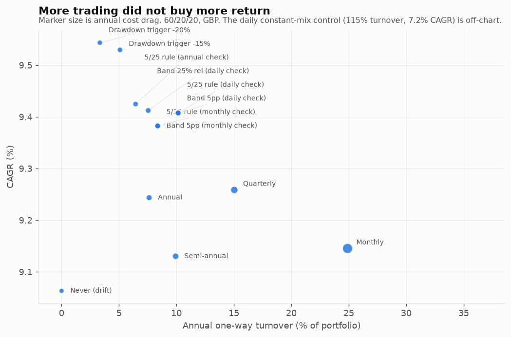
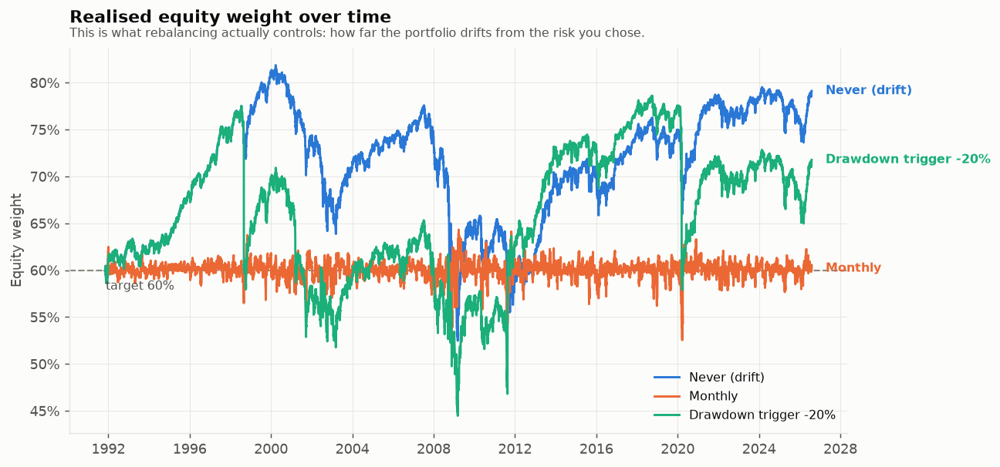

# Rebalancing a multi-asset ISA/SIPP: what the evidence actually supports

*Research, not financial advice. Nothing here is a personal recommendation.
All figures are historical backtests and carry the biases documented in §9.*

---

## 1. Executive summary — the bottom line up front

**The hypothesis does not survive.** The claim under test was that after a
crash with a flight to safety into gold, rebalancing *more often* pays,
because you systematically sell gold high and buy equities low. Across
1991–2026 in sterling I find:

1. **Event-triggered rebalancing beat monthly rebalancing in four of eight
   crashes** measured over the following three years. That is a coin flip. In
   2008–09 — the single best example of a gold flight-to-safety, when gold
   rose 78% in sterling while equities fell 40% — the drawdown-triggered
   policy *underperformed* monthly by 72bps a year over the next three years.
2. **The premise is shakier than the conclusion.** Gold rose in only **six of
   nine** equity drawdowns. In the two fastest crashes — 1998 and March 2020 —
   gold *fell* alongside equities. A flight to safety is a tendency, not a
   mechanism you can schedule around.
3. **Every sensible policy lands within ~40bps a year of every other.**
   Monthly 9.15%, annual 9.24%, the 5/25 rule 9.42%, a −20% drawdown trigger
   9.54%. Against a bootstrap, **none of these gaps is distinguishable from
   noise.** The only difference that *is* statistically distinguishable is the
   daily constant-mix control, which loses 215bps a year to trading costs.
4. **Where the drawdown trigger does look good, a third of its edge is not
   skill.** It ran a 66% average equity weight against a 60% target. Strip
   that allocation effect out and its genuine rebalancing contribution
   (+18bps) is indistinguishable from the 5/25 rule's (+18bps), which achieves
   it while staying far closer to target.
5. **The largest single driver of a UK investor's outcome in this sample was
   not the policy at all — it was sterling.** Unhedged FX added ~0.80% a year
   to every asset, roughly twenty times the spread between the best and worst
   investable policies.

**Recommendation:** use a **5/25 threshold rule checked once a year**, with
new contributions directed at the most underweight asset. Not because it won —
its win is within noise — but because it delivered the sample's best drawdown
(−28.1%) and Ulcer index (6.72) at a sixth of monthly's turnover, and because
an annual check is a rule a human will actually still be following in year
fifteen. §8 argues the case against this recommendation.

**Confidence:** *high* that the differences between reasonable policies are
small and mostly noise; *high* that rebalancing controls risk rather than
enhancing return; *low* that any specific policy is genuinely best.

---

## 2. The mechanism, in plain English

Rebalancing can add return through what is called the **diversification
return** or **volatility harvesting**. The intuition is arithmetic, not
magic.

A portfolio's *compound* growth is roughly its average return minus half its
variance. Volatility is a tax on compounding: a fund that gains 50% then
loses 50% has an average return of zero but is down 25%. Now take two assets
that wiggle differently. Mixing them produces a portfolio less volatile than
the average of its parts. If you hold the *weights* constant — which requires
trading, i.e. rebalancing — you keep the average return of the parts but pay a
smaller variance tax. The difference is the diversification return.

Two names attach to this, and the brief's "Fernholz-Shannon" conflates them.
Both are real:

- **Fernholz & Shay (1982)** formalised the *excess growth rate* of a
  rebalanced portfolio in stochastic portfolio theory
  ([Journal of Finance 37(2), 615–624](https://onlinelibrary.wiley.com/doi/abs/10.1111/j.1540-6261.1982.tb03584.x)).
  (The co-author is Brian Shay, not Shannon.)
- **"Shannon's demon"** is Claude Shannon's 1960s demonstration that a 50/50
  split between cash and a zero-drift random-walk stock, rebalanced each
  period, compounds *upward* — return conjured from volatility alone.

[Booth & Fama (1992)](https://rpc.cfainstitute.org/research/financial-analysts-journal/1992/faj-v48-n3-26)
showed each asset's contribution to a fixed-weight portfolio exceeds its own
compound return by exactly its diversification contribution.
[Willenbrock (2011)](https://arxiv.org/abs/1109.1256) used the same identity
to resolve the commodity-return puzzle, showing that much of what looked like
a commodity risk premium was the rebalancing of a volatile, low-correlation
basket.

### When the premium is negative

This is the part usually left out. The rebalancing premium is **not** a free
lunch. It turns negative when:

- **Assets trend persistently.** Rebalancing sells the winner. If the winner
  keeps winning, you have systematically sold too early. Over 1991–2026
  equities out-compounded bonds by 4.4% a year, so every rebalance was a
  transfer from the higher-drift asset to the lower-drift one.
- **Drifts differ materially.** The bigger the gap in expected returns, the
  more the mechanical drag of trimming the winner overwhelms the variance
  saving.
- **Correlations are high.** The variance saving comes from imperfect
  correlation. As correlation goes to 1, the diversification return goes to 0.
- **Costs and taxes bite.** The premium is measured in tens of basis points.
  Frictions of the same size erase it — see the daily constant-mix control,
  which harvested +12bps of genuine rebalancing return and then paid 215bps to
  get it.

My backtest confirms the drift problem directly: **buy-and-hold's
"rebalancing effect" against monthly is −34bps a year.** Letting equities run
was *worth* something in a 35-year equity bull market. It just came with a
−37.3% drawdown instead of −29.9%.

---

## 3. Momentum, mean reversion, and what frequency they imply

Published research is reasonably consistent on horizons.
[Moskowitz, Ooi & Pedersen (2012)](https://www.aqr.com/Insights/Research/Journal-Article/Time-Series-Momentum)
document time-series momentum persisting for **one to twelve months** and
partially reversing beyond that. Jegadeesh & Titman's cross-sectional
momentum works over 3–12 months; De Bondt & Thaler's reversal effect appears
at 3–5 years.

If prices trend for up to a year and revert after, then a contrarian strategy
— which is what rebalancing is — should *lose* at sub-annual horizons and
*win* at multi-year ones. That predicts an inverted-U: very frequent
rebalancing fights momentum, very infrequent rebalancing lets risk drift, and
something in between is best.

**My data agrees, weakly.** Daily constant mix earned only +12bps of
gross rebalancing return before costs. Monthly rebalancing was the *worst* of
the calendar policies. Annual and threshold policies, which trade roughly once
a year or less, did best. But the spread across the whole sensible range is
~30bps a year against a bootstrap standard error several times larger — so I
would call this *consistent with the literature*, not *confirmation of it*.

---

## 4. What I tested

**Data.** Global equity is a spliced total-return series (VFINX → 55/45
VTSMX+VGTSX from 1996 → ACWI from 2008); bonds are VFITX → IEF from 2002; gold
is the LBMA PM fix, published in USD *and GBP* daily since 1968; FX is FRED's
DEXUSUK; cash is SONIA. Base currency is **GBP**, with a parallel USD run.
Sample **1991-11-01 to 2026-08-04** (34.8 years) — the start is set by the
earliest observed intermediate-Treasury total-return series, not by choice.

**Portfolios.** 60/40, 60/20/20 and 40/30/30 equity/bond/gold. Headline is
60/20/20. **Policies: fifteen variants** — calendar (monthly through annual
and never), absolute ±5pp and relative ±25% bands, the 5/25 rule at daily,
monthly and annual check frequency, −15%/−20% drawdown triggers, cash-flow-only,
and a daily constant-mix control. *Fifteen is a lot of variants; §9 addresses
what that does to the winner.*

**Costs.** Half-spread 4/3/6bp (equity/gilt/gold), £5.95 flat per trade,
£100,000 pot, no explicit FX charge — a UK investor buying a GBP-quoted LSE
ETF pays no per-trade conversion fee; the currency exposure sits unhedged
inside the NAV, which is a risk, not a fee. Sensitivities at 0.5×, 2×, a
£10,000 pot, and a 50bp FX charge for US-listed lines.

---

## 5. Results

The headline table (`results/summary.csv`, 60/20/20, GBP, base costs):

| Policy | CAGR | Vol | Sharpe | Max DD | Ulcer | Turnover/yr | Cost bps | Mean abs weight dev | Mean equity wt |
|---|---|---|---|---|---|---|---|---|---|
| Never (drift) | 9.06% | 13.4% | 0.46 | −37.3% | 9.57 | 0% | 0.0 | **11.3%** | **70.9%** |
| Monthly | 9.15% | 12.1% | 0.51 | −29.9% | 7.20 | 24.9% | 8.6 | 0.7% | 60.0% |
| Quarterly | 9.26% | 12.0% | 0.52 | −29.2% | 7.01 | 15.0% | 3.2 | 1.3% | 60.1% |
| Annual | 9.24% | 11.8% | 0.52 | −28.8% | 6.95 | 7.6% | 1.0 | 2.3% | 60.0% |
| 5/25, annual check | **9.42%** | 11.9% | **0.53** | **−28.1%** | **6.72** | 6.5% | 0.5 | 3.3% | 60.6% |
| Drawdown trigger −20% | **9.54%** | 12.6% | 0.52 | −30.4% | 7.74 | 3.3% | 0.3 | 8.1% | 66.0% |
| Daily constant mix | 7.20% | 12.2% | 0.35 | −33.8% | 9.06 | 115% | 215.5 | 0.2% | 60.0% |

Three things stand out. **Buy-and-hold is not the worst on return — it is the
worst on risk**, at a −37.3% drawdown and an 11.3% average misallocation
against target. **Monthly rebalancing is the worst of the sensible policies**,
paying the most in costs for the least benefit. And the **drawdown trigger's
apparent lead comes with an average equity weight of 66%** against a 60%
target — it was quietly running a riskier portfolio.

### The decomposition — separating skill from extra risk

Splitting each policy's CAGR difference from monthly into *allocation* (held
more equity), *rebalancing* (the genuine effect), and *cost*:

| Policy | Total | Allocation | Rebalancing | Cost |
|---|---|---|---|---|
| Drawdown trigger −20% | +39.8 | **+13.8** | +17.7 | +8.3 |
| 5/25, annual check | +27.9 | +1.9 | +18.0 | +8.1 |
| 5/25, daily check | +26.2 | +2.9 | +15.7 | +7.6 |
| Never (drift) | −8.2 | +17.2 | **−34.0** | +8.6 |
| Daily constant mix | −194.6 | −0.1 | +12.4 | **−206.9** |

The genuine rebalancing contribution is **+12 to +18bps a year** for
everything that trades at sensible frequency. That is the real size of the
effect. A third of the drawdown trigger's headline lead is simply more equity
risk, and buy-and-hold's entire apparent respectability is allocation: strip
it out and its rebalancing effect is the worst in the table.

### Is any of this real? — the bootstrap

2,000 stationary-block resamples (mean block 63 days, seed 42), resampling
whole rows of the return matrix so cross-asset correlation is preserved:

| Policy | Mean diff | 5th–95th pct | Beats monthly | Verdict |
|---|---|---|---|---|
| 5/25, daily check | +13.9 | +0.4 to +26.9 | 95% | directional, within noise |
| Band 5pp, monthly | +12.0 | −1.9 to +25.7 | 91% | directional, within noise |
| 5/25, annual check | +11.5 | −9.5 to +35.3 | 80% | **not distinguishable** |
| Drawdown trigger −20% | +24.1 | −19.2 to +92.8 | 73% | **not distinguishable** |
| Never (drift) | +31.7 | −44.0 to +165.9 | 61% | **not distinguishable** |
| Daily constant mix | −250.3 | −370.8 to −122.9 | 0% | **distinguishable** |

**Only one comparison in the whole study is statistically distinguishable
from noise, and it is the negative one.** Rebalancing daily is reliably bad.
Everything else is a wash.

Rolling windows tell a friendlier story — band policies beat monthly in
**100% of 177 overlapping 20-year windows**, buy-and-hold in 0%. But
overlapping windows are not independent observations; 177 windows from 35
years of data is roughly two non-overlapping samples. They show *consistency
across eras*, which is worth something. They do not show significance.

---

## 6. Crash-conditional analysis — the core question

Nine equity drawdowns of 15%+ appear in the sterling sample. Asset behaviour
peak-to-trough:

| Event | Equity | Bonds | Gold |
|---|---|---|---|
| 1998 | −25.2% | +1.4% | **−2.4%** |
| 2000–03 | −50.1% | +17.9% | +12.1% |
| 2007–09 | −40.1% | +73.5% | **+77.9%** |
| 2011 | −20.2% | +5.1% | +16.5% |
| 2015 | −18.6% | −6.5% | **−10.3%** |
| 2018 | −15.5% | +3.7% | +6.0% |
| 2020 | −26.5% | +12.0% | **−2.2%** |
| 2022 | −15.3% | −6.0% | +10.4% |
| 2025 | −17.9% | +0.4% | +6.0% |

**Gold rose in six of nine.** It fell in 1998, 2015 and — critically — in the
March 2020 crash, when a liquidity scramble forced selling of everything.
The flight-to-safety premise holds often enough to be worth something and
fails often enough that you cannot build a trigger around it.

Performance of the −20% drawdown trigger against monthly, three years from
each trough (bps/yr): **1998 −34, 2003 −43, 2009 −72, 2011 +135, 2015 +185,
2018 −38, 2020 +44, 2022 +123.** Four wins, four losses. The mean is
positive, but with n=8 the standard error swamps it, and the losses cluster
in exactly the episodes the hypothesis says should be its best cases — the
big, gold-friendly crashes of 2003 and 2009.

Why? Because the trigger fires *once*, near the start of a decline, and then
sits out the rest of it. In a long bear market that is early. In a V-shaped
one (2020, 2011) it is well timed. The hypothesis implicitly assumes crashes
end shortly after the trigger fires. Half of them do not.

---

## 7. Correlation instability and the sterling surprise

Gold's relationship to equities is **not stable**. Correlation in stressed
weeks (worst 5% of equity weeks, full-sample threshold):

| Period | Equity/bond, stress | Equity/gold, stress |
|---|---|---|
| Full sample | −0.24 | −0.28 |
| 1990s | +0.05 | **+0.37** |
| 2000s | −0.14 | −0.47 |
| 2010s | +0.02 | −0.09 |
| 2020s | −0.75 | **+0.49** |

The safe-haven property is a *regime*, not a constant: negative in the 2000s,
positive in both the 1990s and the 2020s. Any policy justified by "gold rises
when equities fall" is conditioning on a relationship that has flipped sign
twice in thirty-five years.

**2022 is where the sterling perspective changes the answer.** In dollars,
2022 was the textbook diversification failure: equities −18.4%, bonds −15.2%,
gold +0.4%. In **sterling** the same year was equities −8.8%, bonds −5.2%, and
**gold +12.7%** — because sterling collapsed from 1.35 to 1.07 and cushioned
every unhedged holding. The much-discussed 2022 stock/bond breakdown largely
*did not happen* to an unhedged UK investor.

More generally, sterling depreciation added **+0.81%/yr to equities,
+0.78% to bonds, +0.79% to gold** over the sample. That is an order of
magnitude larger than every policy difference in this study combined. The
honest framing for a UK investor: *your rebalancing policy is a rounding error
next to your currency exposure.*

### Costs, and the taxable-account reversal

Doubling costs, halving them, or adding a 50bp FX charge moves the rankings
barely at all — except for monthly, which is the most cost-sensitive. On a
**£10,000 pot**, flat £5.95 commissions turn monthly rebalancing's drag to
84bps and **destroy the daily constant-mix portfolio entirely** (−100%).
Small pots should rebalance less often, and with fewer lines.

Outside an ISA/SIPP the conclusion **shifts materially**. Estimated CGT drag
(sell-side turnover × embedded gain × rate; 40% gain, 24% higher rate):
monthly **119bps/yr**, quarterly 72, annual 37, 5/25-annual 31, drawdown
trigger 16. Tax is an order of magnitude larger than trading costs and it
scales directly with turnover — so in a General Investment Account the
recommendation moves decisively toward **wider bands, annual checks, and
cash-flow-only rebalancing**. Note this is a first-order estimate that ignores
the annual CGT exemption, share pooling and bed-and-ISA.

---

## 8. The strongest case against my own recommendation

I recommend the 5/25 rule on an annual check. Here is why that may be wrong.

1. **It won inside a fifteen-variant scan, and it does not stay won.** I did
   not pre-register it. Its +28bps edge over monthly has a bootstrap 5th
   percentile of −9.5bps. If I had run fifteen *coin flips* against monthly,
   one would have looked this good. And on the splice-free 2008-onward
   sub-sample it drops from **3rd to 9th** of fourteen, behind the monthly-check
   version of the same rule. This is the single strongest piece of evidence
   against my own recommendation, and it points the same way as everything
   else: the differences are noise.
2. **The honest summary of this study is "it barely matters."** Every
   investable policy lands in a 48bps band over 35 years, and the bootstrap
   cannot separate them. A reader who chooses annual calendar rebalancing
   because it is simpler is giving up nothing measurable.
3. **The drawdown trigger beat it on raw return** (9.54% vs 9.42%) and I am
   still recommending against it — because a third of that lead is extra
   equity risk and its weight deviation is 2.4× worse. That is a judgement
   about *risk control being the point*, not a finding. Someone who thinks the
   point is terminal wealth should reach the opposite conclusion from the
   same table.
4. **The 60/20/20 result flatters gold.** In this sample 60/20/20 beat 60/40
   by 62bps a year with a similar drawdown. Gold returned 8.1%/yr in sterling
   — an outcome I would not assume repeats, and one heavily influenced by two
   specific bull runs.
5. **Threshold rules require you to look.** A calendar rule is a diary entry.
   A band rule needs a check, a calculation, and the discipline to do nothing
   when nothing is breached. Behavioural failure is a bigger risk than 28bps.

Contrast this with the published literature, which is *more* favourable to
rebalancing than my results:
[Dichtl, Drobetz & Wambach (2016)](https://econpapers.repec.org/article/tafapplec/v_3a48_3ay_3a2016_3ai_3a9_3ap_3a772-788.htm)
(Applied Economics 48(9), 772–788) find rebalancing significantly improves
*risk-adjusted* performance across US, UK and German data. Vanguard's
[*Best practices for portfolio rebalancing*](https://corporate.vanguard.com/content/dam/corp/research/pdf/vanguards_principles_for_investing_success.pdf)
(Jaconetti, Kinniry & Zilbering) concludes that there is no optimal frequency
and that risk-adjusted returns do not differ meaningfully between monthly,
quarterly and annual — which matches my finding closely. My results sit
between the two: rebalancing clearly improves risk, and the *choice among*
reasonable rebalancing rules does not matter much.

---

## 9. Biases, and how much to trust this

| Issue | Assessment |
|---|---|
| **Splice artefacts** | Equity is US-only 1991–96 (overlap correlation 0.950); VFITX→IEF correlates 0.945. On the splice-free ACWI-only sub-sample (2008→) the *structural* conclusions all survive — every rebalanced policy beats drift, the drawdown trigger still tops the table, daily constant mix is still last, monthly is still near the bottom of the sensible set. But the **fine ordering reshuffles**: my recommended 5/25-annual falls from 3rd to 9th (10.32% against the 5/25-monthly's 10.55%). That is not a splice artefact so much as direct evidence for the paper's main claim — the gaps between sensible policies are noise, and they reorder when you change the sample. |
| **Overfitting** | Fifteen variants scanned. The winner is selected-in-sample and labelled as such — and, per the row above, does not stay the winner out of sample. |
| **Look-ahead** | Trades execute at the close that triggered them. Re-running with a one-day lag changes headline CAGRs by at most 7bps (5/25-annual +6.8, 5/25-monthly −3.9). Not material. |
| **Small samples** | Nine crashes, eight with three years of follow-on. Any crash-conditional claim here is weak by construction. |
| **Survivorship** | VFINX/VFITX/VTSMX all survived to today. Small upward bias in the pre-2008 segment. |
| **Timestamp mismatch** | The LBMA fix is struck 5½ hours before the US close, so same-day gold/equity correlation reads 0.66 against 0.98 monthly. All correlation work is therefore weekly. Portfolio vol from daily returns (12.21%) exceeds the weekly-sampled figure (11.32%), so risk numbers are if anything conservative. |
| **Not modelled** | Bid-ask widening in crises, ETF premium/discount, fund closure, platform fees, and the investor's own behaviour. |

**Confidence by claim.** *Robust across all windows, currencies, cost
assumptions and both samples:* rebalancing controls risk; buy-and-hold drifts
to materially more risk; daily rebalancing is destroyed by costs; frequency
choice among sensible options is second-order. *Holds in this sample only:*
the specific ranking of 5/25 above annual above monthly; gold's contribution
to the 60/20/20 result. *Explicitly rejected:* that more frequent rebalancing
reliably pays after a gold-flight crash.

---

## 10. A decision rule you can operate in twenty minutes a year

Once a year, on a date you fix in advance and never move:

1. **Write down** the current value of each holding and the total.
2. **Compute** each weight, and its gap from target.
3. **Trade only if** some asset is off by **5 percentage points or more**, or
   by **25% of its own target weight or more** — whichever is smaller for that
   asset. (For a 20% gold sleeve, that is 25% relative, i.e. outside 15–25%.
   For a 60% equity sleeve, that is 5pp, i.e. outside 55–65%.)
4. **If nothing is breached, do nothing.** In this sample that was the usual
   outcome: the rule traded 0.43 times a year — roughly **once every 28
   months**. Most annual reviews end with no trade at all.
5. **If something is breached, trade everything back to target** in one go.
6. **Direct all new contributions at the most underweight asset**, always,
   whether or not a band is breached. Cash-flow rebalancing alone recovered
   monthly's return (9.16%) with **zero** turnover, though it only got about
   40% of the way on risk control (6.98% mean weight deviation against
   monthly's 0.74%) — good, not sufficient, so keep the annual check too.
7. **In a taxable account,** widen to cash-flow-only plus a 10pp band, and use
   the annual CGT exemption deliberately.

The point of this rule is not the 28 basis points. It is that in March 2009
your portfolio was 60/20/20 by design rather than 78% equities by neglect —
and that you are still running it in 2045.

---

*Full metrics: [`results/summary.csv`](../../data/rebalancing/results/summary.csv).
Reproduce with `python scripts/rebalancing/run_study.py` — see
[README](README.md). Research, not financial advice.*
